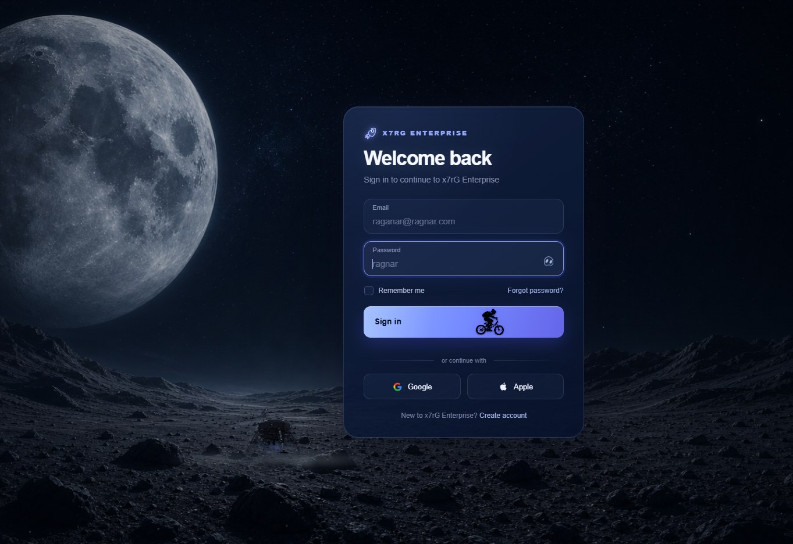
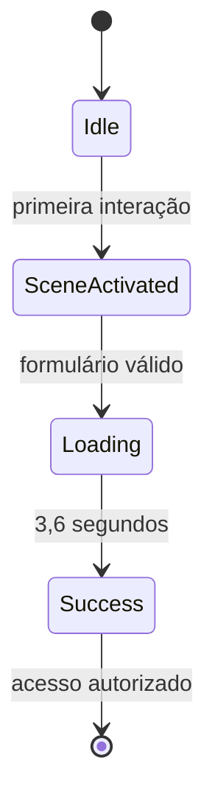
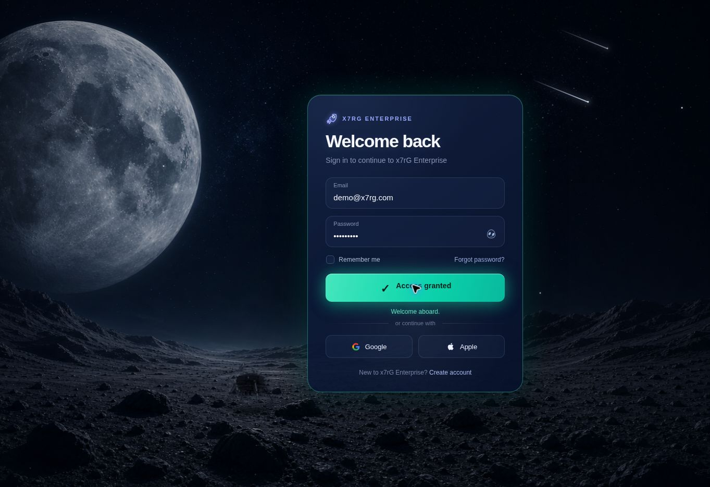

# x7rG Login Experience

> Uma missão além do login.

[](https://nextjs.org/)
[](https://react.dev/)
[](https://www.typescriptlang.org/)
[](https://xx7rg.github.io/x7rg-login-experience/)

Uma experiência cinematográfica de autenticação criada pela **x7rG Enterprise**. O projeto transforma uma tela de login em uma pequena narrativa espacial, combinando interface, movimento, áudio procedural e ambientação visual em tempo real.

## Demonstração

**Projeto online:** [xx7rg.github.io/x7rg-login-experience](https://xx7rg.github.io/x7rg-login-experience/)


## Sobre a experiência

Ao abrir a página, o usuário encontra um cenário lunar com profundidade, estrelas, névoa e uma interface translúcida. A primeira interação ativa a sequência de pouso da nave e o áudio sincronizado. Ao enviar o formulário, o botão se transforma em palco para uma animação de bicicleta e a interface conclui a jornada com o estado **Access granted**.



### Principais recursos

- cenário lunar cinematográfico e responsivo;
- pouso animado com propulsores, fumaça, poeira e impacto;
- estrelas pulsantes, estrelas cadentes, satélite e névoa ambiental;
- cartão de login com brilho reativo ao movimento do ponteiro;
- alternância de visibilidade da senha e opção “Remember me”;
- mensagens demonstrativas para recuperação, cadastro, Google e Apple;
- fluxo visual de autenticação com estados `idle`, `loading` e `success`;
- animação de bicicleta integrada ao botão de acesso;
- áudio procedural criado em tempo real com Web Audio API;
- adaptação para desktop, tablet, celular e WebView.

## Fluxo de interação





## Tecnologias

| Tecnologia | Papel no projeto |
| --- | --- |
| Next.js 16 | estrutura da aplicação, compilação e exportação estática |
| React 19 | componente, estado e eventos da interface |
| TypeScript 5 | tipagem e segurança durante o desenvolvimento |
| CSS | cenário, responsividade, efeitos e animações cinematográficas |
| Web Audio API | síntese dos sons de ativação, movimento, motor e pouso |
| GitHub Actions | automação da compilação e publicação |
| GitHub Pages | hospedagem da demonstração pública |

## Arquitetura

```text
x7rg-login-experience/
├── .github/
│   └── workflows/
│       └── deploy-pages.yml
├── app/
│   ├── globals.css
│   ├── layout.tsx
│   └── page.tsx
├── docs/
│   └── images/
├── public/
│   ├── et-bicycle-reference.png
│   ├── favicon.svg
│   ├── lunar-lander-right-ridge.png
│   ├── lunara-desert-bg.png
│   ├── opportunity-rover.png
│   └── x7rg-lunar-landscape.png
├── next.config.ts
├── package.json
└── tsconfig.json
```

### Arquivos principais

- `app/page.tsx`: formulário, estados, eventos, sequências temporizadas e síntese de áudio.
- `app/globals.css`: direção visual, composição do cenário, animações e breakpoints.
- `app/layout.tsx`: metadados, título, favicon e variáveis de recursos públicos.
- `next.config.ts`: exportação estática e suporte ao caminho do GitHub Pages.
- `.github/workflows/deploy-pages.yml`: pipeline de instalação, build e deploy.

## Executar localmente

### Requisitos

- Node.js 22.13 ou superior;
- npm;
- navegador moderno com suporte à Web Audio API.

```bash
git clone https://github.com/xx7rg/x7rg-login-experience.git
cd x7rg-login-experience
npm install
npm run dev
```

Abra o endereço exibido no terminal, normalmente [http://localhost:3000](http://localhost:3000).

### Comandos disponíveis

| Comando | Finalidade |
| --- | --- |
| `npm run dev` | inicia o ambiente local de desenvolvimento |
| `npm run build` | gera a versão estática de produção em `out/` |
| `npm run start` | inicia o servidor Next.js quando aplicável |
| `npm run lint` | verifica a qualidade do código |

## Publicação no GitHub Pages

O workflow é executado automaticamente após cada `push` para a branch `main`. Durante a publicação, o projeto:

1. instala as dependências com `npm ci`;
2. define `/x7rg-login-experience` como caminho-base;
3. gera a exportação estática em `out/`;
4. prepara o GitHub Pages;
5. publica o artefato final.

Para publicar uma alteração:

```bash
git add .
git commit -m "Descreva a alteração"
git push origin main
```

## Acessibilidade e comportamento

- campos associados a rótulos visíveis;
- mensagens de estado anunciadas com `aria-live`;
- botão de senha com `aria-label` e `aria-pressed`;
- controles nativos de formulário e navegação por teclado;
- redução de efeitos em telas menores e adaptação especial para WebView;
- nenhuma credencial é enviada ou armazenada.

## Escopo atual

Este repositório é uma **demonstração visual e educacional**. O formulário simula a autenticação no navegador e não possui banco de dados, sessão de usuário ou integração real com Google e Apple.

Para uso em produção, seriam necessários backend de autenticação, comunicação HTTPS, tratamento de sessão, proteção contra abuso, recuperação segura de senha e validações no servidor.

## Autoria

Conceito, design e desenvolvimento por **x7rG Enterprise**.

---

Se esta experiência chamou sua atenção, deixe uma estrela no repositório. 🚀🌕
