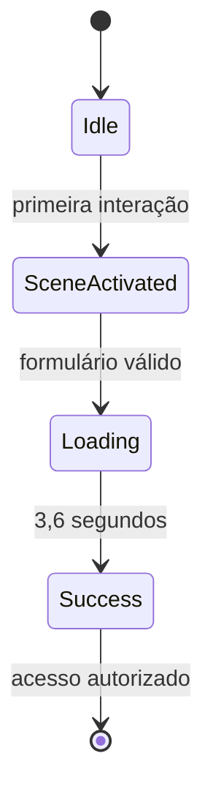

<div align="center">


# Login Experience by: x7rG

</div>

> Uma missão além do login.

[](https://nextjs.org/)
[](https://react.dev/)
[](https://www.typescriptlang.org/)
[](https://login-the-moon-x7rg.contato-rgsantos.workers.dev)

Uma experiência cinematográfica de autenticação publicada e mantida pela **x7rG Enterprise**. O projeto transforma uma tela de login em uma pequena narrativa espacial, combinando interface, movimento, áudio procedural e ambientação visual em tempo real.

## Demonstração

**Projeto online:** [login-the-moon-x7rg.contato-rgsantos.workers.dev](https://login-the-moon-x7rg.contato-rgsantos.workers.dev)


## Sobre a experiência

Ao abrir a página, o usuário encontra um cenário lunar com profundidade, estrelas, névoa e uma interface translúcida. A primeira interação ativa a sequência de pouso da nave e o áudio sincronizado. Ao enviar o formulário, o botão se transforma em palco para uma animação de bicicleta e a interface conclui a jornada com o estado **Access granted**.

> **Nota:** a silhueta da bicicleta é a imagem `bmx.png`, fornecida por Rogério para substituir a anterior, que veio da internet (origem e licença desconhecidas) e foi retirada. Veja [Procedência e uso de IA](#procedência-e-uso-de-ia).


### Principais recursos

- cenário lunar cinematográfico e responsivo;
- pouso animado com propulsores, fumaça, poeira e impacto;
- estrelas pulsantes, estrelas cadentes, satélite e névoa ambiental;
- cartão de login com brilho reativo ao movimento do ponteiro;
- alternância de visibilidade da senha e opção “Remember me”;
- mensagens demonstrativas para recuperação, cadastro, Google e Apple;
- fluxo visual de autenticação com estados `idle`, `loading` e `success`;
- sequência de bicicleta integrada ao botão de acesso;
- áudio procedural criado em tempo real com Web Audio API;
- adaptação para desktop, tablet, celular e WebView.

## Fluxo de interação




## Tecnologias

| Tecnologia | Papel no projeto |
| --- | --- |
| Next.js 16 | estrutura da aplicação, compilação e exportação estática |
| React 19 | componente, estado e eventos da interface |
| TypeScript 5 | tipagem e segurança durante o desenvolvimento |
| CSS | cenário, responsividade, efeitos e animações cinematográficas |
| Web Audio API | síntese dos sons de ativação, movimento, motor e pouso |
| GitHub Actions | automação da compilação e publicação |
| GitHub Pages | hospedagem da demonstração pública |

## Arquitetura

```text
Login-The-Moon/
├── .github/
│   └── workflows/
│       └── deploy-pages.yml
├── app/
│   ├── globals.css
│   ├── layout.tsx
│   └── page.tsx
├── docs/
│   └── images/                       (3 capturas de tela)
├── public/
│   ├── .nojekyll
│   ├── assets/
│   │   └── bmx-silhouette.png
│   ├── camel-caravan-realistic.png   (não usado)
│   ├── favicon-x7rg.png
│   ├── lunar-lander-right-ridge.png
│   ├── lunara-desert-bg.png          (não usado)
│   ├── opportunity-rover.png         (não usado)
│   ├── x7rg-enterprise-emblem.png
│   └── x7rg-lunar-landscape.png
├── eslint.config.mjs
├── next.config.ts
├── package.json
├── package-lock.json
├── postcss.config.mjs
├── tsconfig.json
└── wrangler.jsonc
```

### Arquivos principais

- `app/page.tsx`: formulário, estados, eventos, sequências temporizadas e síntese de áudio.
- `app/globals.css`: direção visual, composição do cenário, animações e breakpoints.
- `app/layout.tsx`: metadados, título, favicon e variáveis de recursos públicos.
- `next.config.ts`: exportação estática e suporte ao caminho do GitHub Pages.
- `.github/workflows/deploy-pages.yml`: pipeline de instalação, build e deploy.

## Executar localmente

### Requisitos

- Node.js 22.13 ou superior;
- npm;
- navegador moderno com suporte à Web Audio API.

```bash
git clone https://github.com/xx7rg/Login-The-Moon.git
cd Login-The-Moon
npm install
npm run dev
```

Abra o endereço exibido no terminal, normalmente [http://localhost:3000](http://localhost:3000).

### Comandos disponíveis

| Comando | Finalidade |
| --- | --- |
| `npm run dev` | inicia o ambiente local de desenvolvimento |
| `npm run build` | gera a versão estática de produção em `out/` |
| `npm run start` | inicia o servidor Next.js quando aplicável |
| `npm run lint` | verifica a qualidade do código |

## Publicação no GitHub Pages

O workflow é executado automaticamente após cada `push` para a branch `main`. Durante a publicação, o projeto:

1. instala as dependências com `npm ci`;
2. define `/Login-The-Moon` como caminho-base;
3. gera a exportação estática em `out/`;
4. prepara o GitHub Pages;
5. publica o artefato final.

Para publicar uma alteração:

```bash
git add .
git commit -m "Descreva a alteração"
git push origin main
```

## Acessibilidade e comportamento

- campos associados a rótulos visíveis;
- mensagens de estado anunciadas com `aria-live`;
- botão de senha com `aria-label` e `aria-pressed`;
- controles nativos de formulário e navegação por teclado;
- redução de efeitos em telas menores e adaptação especial para WebView;
- nenhuma credencial é enviada ou armazenada.

## Procedência e uso de IA

O projeto é publicado e mantido pela **x7rG Enterprise** (Rogério Gomes). Segundo Rogério, os elementos abaixo foram feitos com IA:

- o cenário (as imagens da cena lunar);
- o som (a síntese sonora procedural que está em `app/page.tsx`);
- o movimento/animação da bicicleta;
- o pouso do módulo lunar.

A autoria do conceito geral e da luz reativa ao ponteiro não está registrada neste repositório.

### Materiais de terceiros e de origem não resolvida

- **Silhueta anterior da bicicleta (retirada e substituída):** o arquivo usado até a versão anterior (`public/assets/et-bicycle-reference.png`) foi obtido da internet por Rogério. Ele não a gerou com IA, e a fonte e a licença são desconhecidas. Por isso a imagem saiu da experiência e da pasta publicada, e este projeto não declara direitos sobre ela. Ela continua acessível no histórico do Git (commits anteriores a esta remoção). Nenhum trecho ativo do código ou da página a referencia.
- **Imagens sem procedência registrada no repositório:**

| Arquivo | Uso | O que o repositório registra |
| --- | --- | --- |
| `assets/bmx-silhouette.png` | silhueta da bicicleta do botão "Sign in" | `bmx.png` fornecido por Rogério para substituir a anterior, usado sem alteração. O arquivo traz metadados C2PA de geração por IA (gerador "OpenAI Media Service API", ChatGPT / gpt-image, 21/09/2026), que comprovam apenas a origem deste arquivo; autoria e licença não estão registradas |
| `x7rg-lunar-landscape.png` | cenário principal (fundo) | sem metadados; cenário feito com IA, segundo Rogério |
| `lunar-lander-right-ridge.png` | módulo lunar da sequência de pouso | sem metadados; procedência do arquivo não registrada (o pouso, segundo Rogério, foi feito com IA) |
| `lunara-desert-bg.png` | não usado | metadados C2PA de geração por IA (OpenAI, 28/07/2026) |
| `opportunity-rover.png` | não usado (existe só uma regra de CSS; nenhum elemento a exibe) | sem metadados; procedência não registrada |
| `camel-caravan-realistic.png` | não usado (idem) | sem metadados; procedência não registrada |
| `x7rg-enterprise-emblem.png` e `favicon-x7rg.png` | marca x7rG (favicon e preview de link) | o emblema tem metadados C2PA de geração por IA (OpenAI, 14/08/2026); o favicon é uma redução dele |
| `docs/images/*.png` | capturas de tela deste projeto | arquivos JPEG com extensão `.png`, sem metadados |

### Silhueta da bicicleta

A sequência do botão "Sign in" (3,42 s, movimento, rodas giratórias, poeira, trilha e lua) é feita em CSS. A silhueta é o arquivo `public/assets/bmx-silhouette.png` (1388×1133 px, RGBA, fundo transparente), definido em `bicycleSilhouette` em `app/layout.tsx`. É o `bmx.png` fornecido por Rogério, copiado sem alteração. A imagem não contém lua; a lua da sequência continua sendo apenas o elemento CSS existente.

O desenho não preenche o quadro (ocupa cerca de 82% da largura e 94% da altura, com margens desiguais), então o recorte fica em `app/globals.css`: `.bike-reference-art` posiciona e dimensiona a imagem (`background-position` e `background-size`) para que o desenho tenha cerca de 45 px de altura dentro do quadro de 52 px, sem tocar as bordas da cena, e `.bike-wheel-motion-rear` e `-front` posicionam as rodas giratórias sobre as rodas do desenho. Esses valores foram medidos para este arquivo: se ele for trocado, o recorte e as rodas precisam ser medidos de novo.

## Escopo atual

Este repositório é uma **demonstração visual e educacional**. O formulário simula a autenticação no navegador e não possui banco de dados, sessão de usuário ou integração real com Google e Apple.

Para uso em produção, seriam necessários backend de autenticação, comunicação HTTPS, tratamento de sessão, proteção contra abuso, recuperação segura de senha e validações no servidor.

---

<p align="center">Se esta experiência chamou sua atenção, deixe uma estrela no repositório. 🚀🌕</p>

---

<div align="center">

**Publicado e mantido por x7rG ENTERPRISE™.** Este repositório não define uma licença de uso. Materiais de terceiros, gerados com IA ou de origem não resolvida (veja [Procedência e uso de IA](#procedência-e-uso-de-ia)) não são cobertos por nenhuma declaração de direitos da x7rG.

[](https://www.linkedin.com/in/rgds)
&nbsp;
[](https://www.instagram.com/_7ragnar/)

</div>
